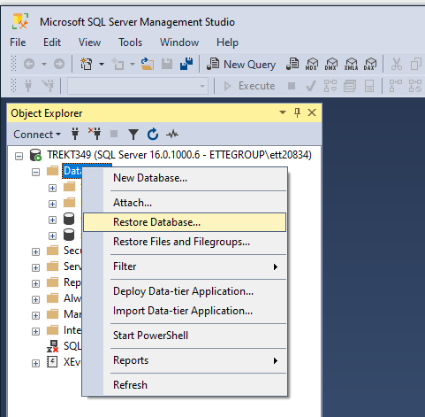
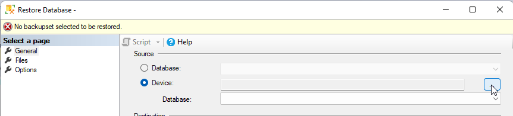
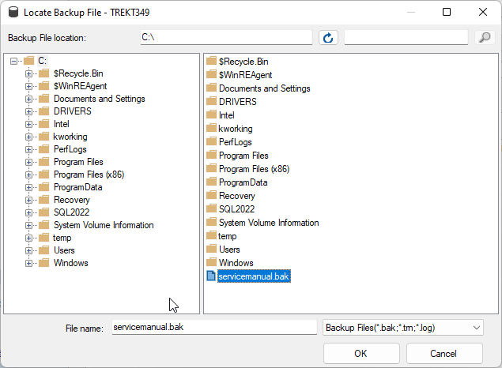
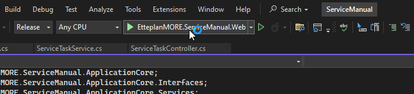
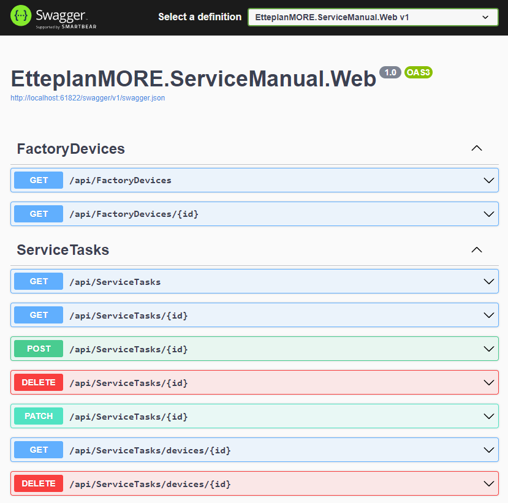

# Instructions to run

This project uses Microsoft SQL Server, to seed the database with the starting csv file you can use either MS SQL Management Studio
or the one integrated into Visual Studio.

## Microsoft SQL Server

Download and install Microsoft SQL Server from [here](https://www.microsoft.com/en-us/sql-server/sql-server-downloads)

## Microsoft SQL Server Management Studio

Download and install Microsoft SQL Server Management Studio from [here](https://learn.microsoft.com/en-us/sql/ssms/download-sql-server-management-studio-ssms?view=sql-server-ver16)

You need to copy the backup file to `C:\` since Management Studio doesn't have access to your user profile 

Right click on `Databases` and click on Restore Database

Tick the device option and click on the three dots on the right

Click Add and find the bak file on your `C:\` drive 

Build the project with Visual Studio and click the Run and Debug button

Navigate to *<http://localhost:61822/swagger/>* to check if the server is working
